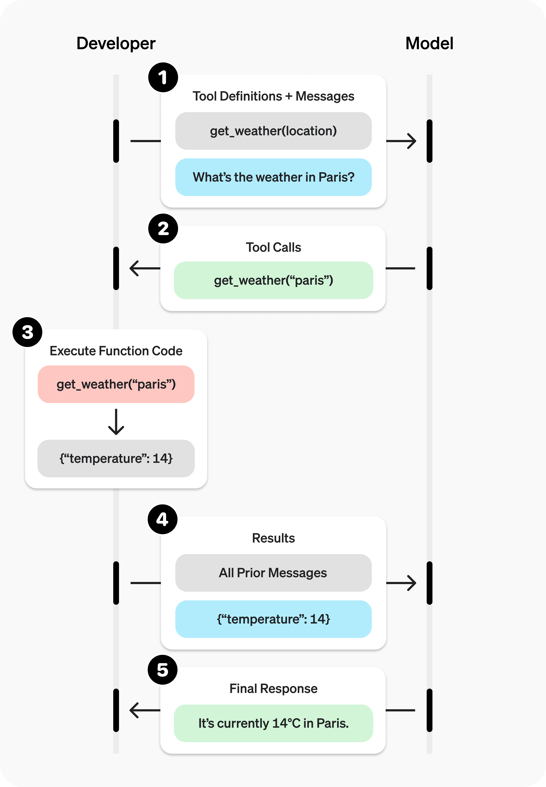
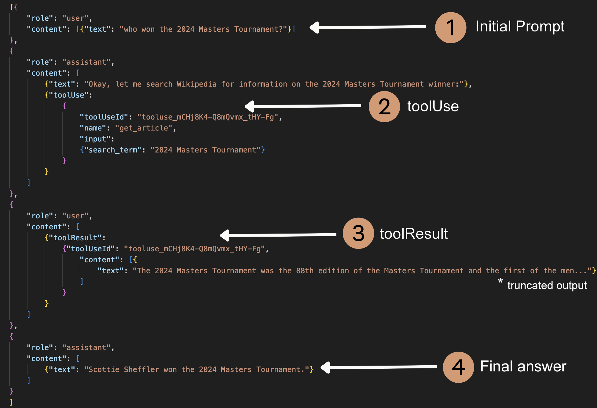
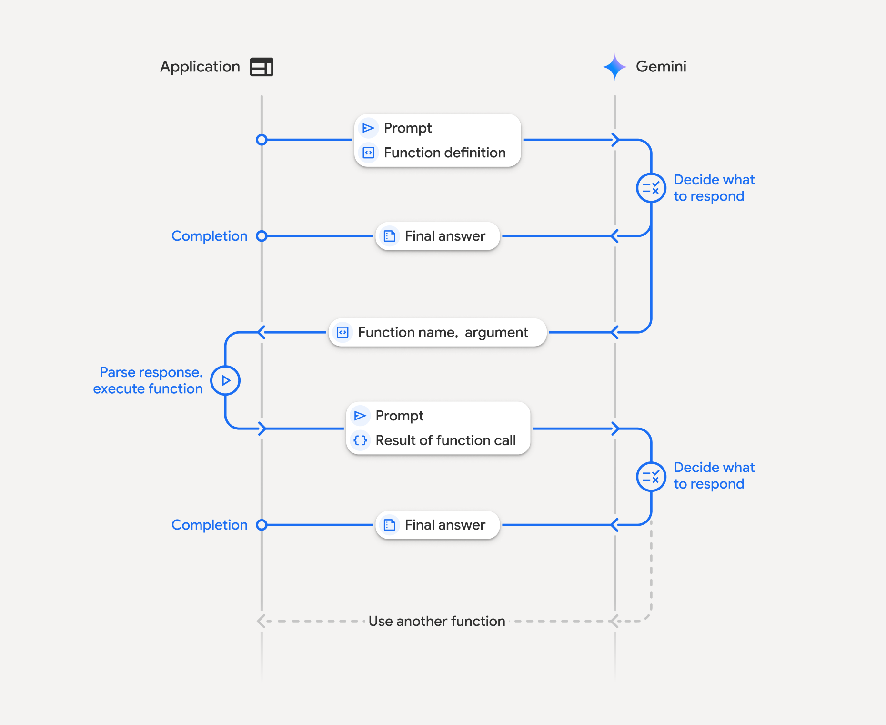

# OpenAI
[Function calling](https://platform.openai.com/docs/guides/function-calling)

## 1. Call initialing
key fields: tools:[{type, function(name, description, parameters)}]

```py
from openai import OpenAI

client = OpenAI()

tools = [{
    "type": "function",
    "function": {
        "name": "get_weather",
        "description": "Get current temperature for a given location.",
        "parameters": {
            "type": "object",
            "properties": {
                "location": {
                    "type": "string",
                    "description": "City and country e.g. Bogotá, Colombia"
                }
            },
            "required": [
                "location"
            ],
            "additionalProperties": False
        },
        "strict": True
    }
}]

completion = client.chat.completions.create(
    model="gpt-4.1",
    messages=[{"role": "user", "content": "What is the weather like in Paris today?"}],
    tools=tools
)
```
## 2. LLM model choose tool
response: tool_calls[{id, type, function(name, arguments)}]
```py
print(completion.choices[0].message.tool_calls)

[{
    "id": "call_12345xyz",
    "type": "function",
    "function": {
        "name": "get_weather",
        "arguments": "{\"location\":\"Paris, France\"}"
    }
}]
```
## 3. return Tool result
```py
messages.append(completion.choices[0].message)  # append model's function call message
messages.append({                               # append result message
    "role": "tool",
    "tool_call_id": tool_call.id,
    "content": str(result)
})

completion_2 = client.chat.completions.create(
    model="gpt-4.1",
    messages=messages,
    tools=tools,
)
```



# Claude
[Tool use Workflow](https://github.com/aws-samples/prompt-engineering-with-anthropic-claude-v-3/blob/main/10_2_3_Complete_Tool_Use_Workflow.ipynb)

## 1. Initializing calling
key fields: tools:[{name, description, input_schema}]
```sh
curl https://api.anthropic.com/v1/messages \
  -H "content-type: application/json" \
  -H "x-api-key: $ANTHROPIC_API_KEY" \
  -H "anthropic-version: 2023-06-01" \
  -d '{
    "model": "claude-3-7-sonnet-20250219",
    "max_tokens": 1024,
    "tools": [
      {
        "name": "get_weather",
        "description": "Get the current weather in a given location",
        "input_schema": {
          "type": "object",
          "properties": {
            "location": {
              "type": "string",
              "description": "The city and state, e.g. San Francisco, CA"
            }
          },
          "required": ["location"]
        }
      }
    ],
    "messages": [
      {
        "role": "user",
        "content": "What is the weather like in San Francisco?"
      }
    ]
  }'
```

## 2. LLM choose tool
response: content[{type, id, name, input}]
``` json
{
  "role": "assistant",
  "content": [
    {
      "type": "text",
      "text": "<thinking>To answer this question, I will: 1. Use the get_weather tool to get the current weather in San Francisco. 2. Use the get_time tool to get the current time in the America/Los_Angeles timezone, which covers San Francisco, CA.</thinking>"
    },
    {
      "type": "tool_use",
      "id": "toolu_01A09q90qw90lq917835lq9",
      "name": "get_weather",
      "input": {"location": "San Francisco, CA"}
    }
  ]
}
```
## 3. Response after tool exectution
user response: content[{ToolResults{toolUseId, content}]

```py
tool_response = {
    "role": "user",
    "content": [
        {
            "toolResult": {
                "toolUseId": tool_id,
                "content": [
                    {
                        "text": wiki_result
                        }
                ]
            }
        }
    ]
}
```


# Google Gemini
## 1 Initalizing call
```sh
curl "https://generativelanguage.googleapis.com/v1beta/models/gemini-2.0-flash:generateContent?key=$GEMINI_API_KEY" \
  -H 'Content-Type: application/json' \
  -X POST \
  -d '{
    "contents": [
      {
        "role": "user",
        "parts": [
          {
            "text": "Schedule a meeting with Bob and Alice for 03/27/2025 at 10:00 AM about the Q3 planning."
          }
        ]
      }
    ],
    "tools": [
      {
        "functionDeclarations": [
          {
            "name": "schedule_meeting",
            "description": "Schedules a meeting with specified attendees at a given time and date.",
            "parameters": {
              "type": "object",
              "properties": {
                "attendees": {
                  "type": "array",
                  "items": {"type": "string"},
                  "description": "List of people attending the meeting."
                },
                "date": {
                  "type": "string",
                  "description": "Date of the meeting (e.g., '2024-07-29')"
                },
                "time": {
                  "type": "string",
                  "description": "Time of the meeting (e.g., '15:00')"
                },
                "topic": {
                  "type": "string",
                  "description": "The subject or topic of the meeting."
                }
              },
              "required": ["attendees", "date", "time", "topic"]
            }
          }
        ]
      }
    ]
  }'
```

